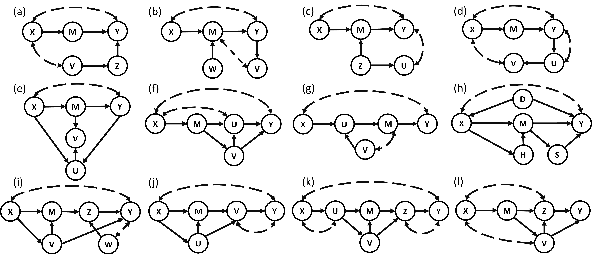

# Clear2026_Submission_5
This is an anomynised code repo for CLEAR2026 submission #5, entitled: Front-door Reducibility: Reducing ADMGs to the Standard Front-door Setting via a Graphical Criterion

It provides:

- An implementation of the FDR triple identification algorithm `triple_id`, which finds valid front-door-reducible triples $( \\mathbf{X}^{\\ast}, \\mathbf{Y}^{\\ast}, \\mathbf{M}^{\\ast} )$ in an ADMG.
- Example scripts that reproduce the FDR and non-FDR graphs discussed in the paper and run the identification algorithm on them.

## Front-door Reducibility (FDR)

Front-door adjustment gives a simple closed-form identification formula under the classical front-door criterion, but its applicability is often viewed as narrow. By contrast, the general ID algorithm can identify many more causal effects in arbitrary graphs, yet typically outputs algebraically complex expressions that are hard to estimate and interpret. We show that many such graphs can in fact be reduced to a standard front-door setting via front-door reducibility (FDR), a graphical condition on acyclic directed mixed graphs that aggregates variables into super-nodes $( \\mathbf{X}^{\\ast}, \\mathbf{Y}^{\\ast}, \\mathbf{M}^{\\ast} )$. We characterize the FDR criterion, prove it is equivalent (at the graph level) to the existence of an FDR adjustment, and present FDR-TID, an exact algorithm that finds an admissible FDR triple with correctness, completeness, and finite-termination guarantees. Empirical examples show that many graphs far outside the textbook front-door setting are FDR, yielding simple, estimable adjustments where general ID expressions would be cumbersome. FDR therefore complements existing identification methods by prioritizing interpretability and computational simplicity without sacrificing generality across mixed graphs.

## Usage instructions

### Requirements

The code was tested with:

- Python 3.9+
- [pandas](https://pandas.pydata.org/)
- [numpy](https://numpy.org/)
- [graphviz](https://graphviz.org/) (for graph visualisation, if needed)

The directory `code/local_grapl` contains a lightweight ADMG / graph library used by the examples (a local copy of the GRAPL-style tools).

To install the Python dependencies with `pip`:

```bash
pip install pandas numpy graphviz
```

### Reproducing the examples from the paper

<div align="center">
  
</div>

<p align="center"><strong>Figure 2 in the paper: ADMGs that satisfy FDR criterion.</p>


From the repository root:

``` bash
cd code

# FDR examples (Figures 1–2 in the paper)
python FDR_examples_in_paper.py

# Non-FDR examples (Figure 3 in the paper)
python nonFDR_examples_in_paper.py
```

These scripts:

- Define the ADMGs used in the paper via a simple graph description language.

- Call ``triple_id`` to search for FDR triples for each example graph.

- Return:

  - ``FDR_triple_identifiable``: a boolean indicating whether at least one FDR triple is found.

  - ``triple_result``: either a ``dict`` or a ``pandas.DataFrame`` with the valid triples, depending on the output argument.

You can edit the test graphs in these scripts to try your own ADMGs.

## Repository structure and remark

```text
.
├── README.md                 # This file
└── code/
    ├── FDR_triple.py         # Implementation of FDR triple identification (core algorithm)
    ├── FDR_examples_in_paper.py
    │                         # Examples of FDR ADMGs (Figures 1–2) and calls to triple_id
    ├── nonFDR_examples_in_paper.py
    │                         # Examples of non-FDR ADMGs (Figure 3) and calls to triple_id
    └── local_grapl/          # ADMG / graph processing utilities
        └── ...
```
